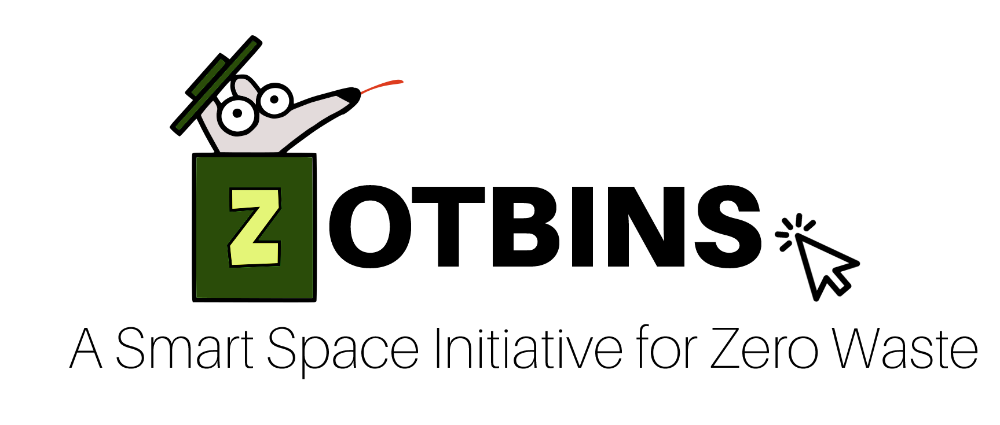

# ZotBins Web Application for Trash Disposal Management

This project is a web app intended to be a tool for management (organizations that handle placement of bins, bin signage, etc) to better understand collected waste data. Features include  
* data visualization in charts and graphs
* check indivdual bin status eg. checking if a bin needs maintenance
* registering new bins to collect data

## Running the app
1. Make sure you have one of the following package managers:
  * npm(comes with react) - https://www.npmjs.com/  
  * yarn - https://yarnpkg.com/  
  
### Client-side
2. Open a terminal in `client/` and install dependencies with `npm install` or `yarn install`  
3. Run the webapp with `npm start` or `yarn start`  
The web app will be running on `http://localhost:3000/` and will detect changes in source code.

### Server-side
2. Open a terminal in `server/` and install dependencies with `npm install` or `yarn install`  
3. Run the webapp with `nodemon`  
The web app will be running on `http://localhost:9000/` and will detect changes in source code.
